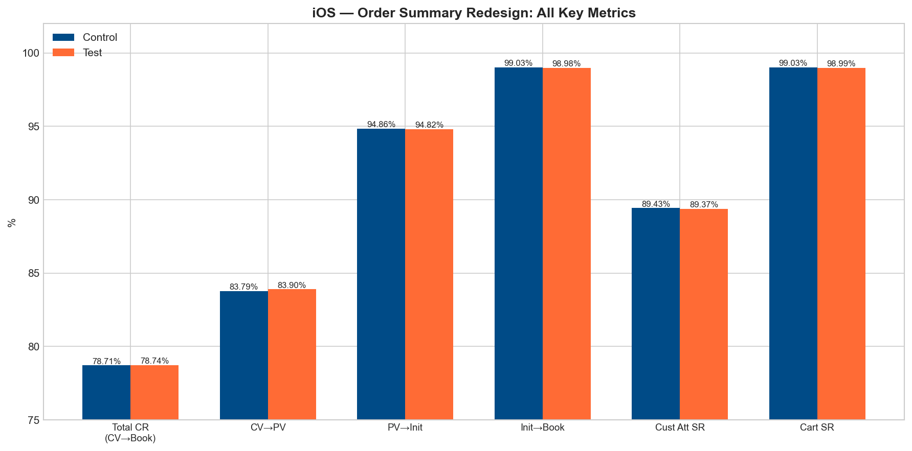
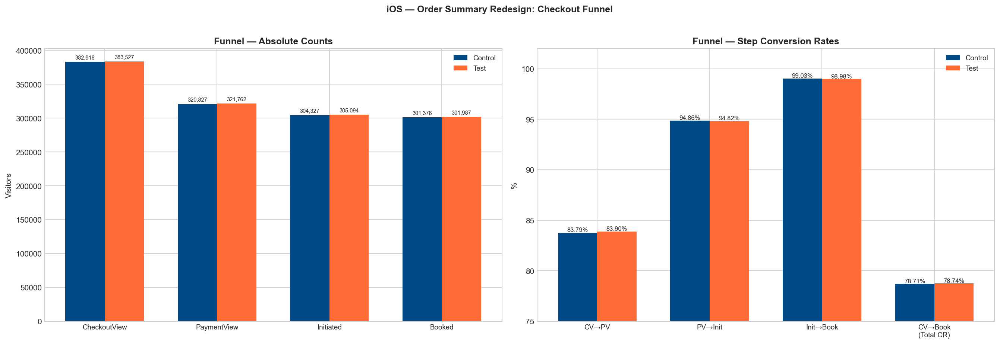
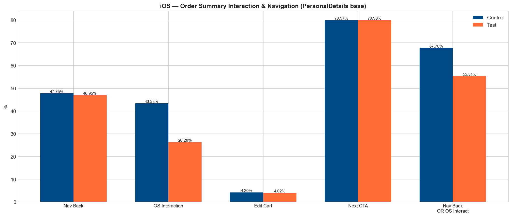
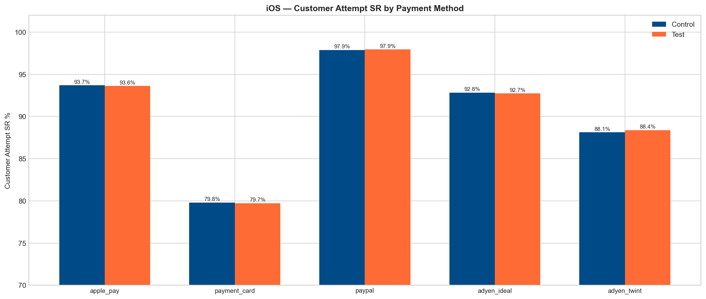

| | |
|---|---|
| **Experiment plan link** | [Order Summary Card Redesign: Experimentation Plan](https://getyourguide.atlassian.net/wiki/spaces/PAYT/pages/4052877337/Order+Summary+Card+Redesign+Experimentation+Plan) |
| **Looker / Statsig link** | Experiment key: `pay-order-summary-card-redesign-ios::2` *(Add Statsig/Looker links once available.)* |
| **Hypothesis** | **FOR** customers in iOS single-activity checkout on Personal Details / Checkout screen **IF** we surface key booking info (title, participants, date, time) directly in the collapsed Order Summary card **THEN** users will need fewer "re-check" actions (expand, back navigation), maintain or improve funnel progression, and not harm attempt-level quality / conversion. |
| **Roll-out decision** | **Ship / safe to roll out on iOS.** No measurable conversion impact, large reduction in Order Summary interaction and small reduction in back navigation, with no meaningful attempt-quality regressions. |

# Summary

### Metrics outcome:

- **Experiment setup:** iOS, 50/50 split, 30 days (start: 2026-03-24, analysis: 2026-04-23). Base = visitors reaching **CheckoutView**.
- **Sample size:** 382,916 control / 383,527 test (CheckoutView base).
- **Total conversion rate:** +0.034pp (+0.04% rel), **p=0.717** → flat / not significant.
- **Funnel steps:**
  - CheckoutView → PaymentView: +0.11pp, p=0.19 (flat).
  - PaymentView → PaymentInit: −0.04pp, p=0.50 (flat).
  - PaymentInit → Booking: −0.05pp, p=0.055 (borderline; still tiny in magnitude).
- **Order Summary interaction:** **−17.1pp (−39.4%)**, **p<0.001** → large reduction (users no longer need to expand/interact to see info).
- **Navigation back:** **−0.8pp (−1.7%)**, **p<0.001** → fewer users navigate away from the step.
- **Attempt-level quality:**
  - Customer Attempt SR: −0.06pp, p=0.29 (flat).
  - Cart SR: −0.04pp, p=0.046 (stat-sig but extremely small; treat as "watch" not "block").
- **SRM:** passed (p=0.485).

### Key learnings:

- **The redesign succeeded at its UX mechanism, not at conversion:** The treatment massively reduced Order Summary interaction (−39%), which is exactly what you'd expect if key info is visible without expanding. This is a strong signal the UI change worked as intended.
- **Flat conversion is the correct interpretation (not "no value"):** This change removes friction (expand/back) but does not create additional user intent; therefore conversion lift was never guaranteed. The right success bar here is "improves clarity without harming conversion," which the data supports.
- **Do not over-claim reductions in cancellations or misunderstandings:** The results show less re-check behavior; they do *not* show downstream cancellation reason improvements in this analysis, so avoid claiming that outcome unless a dedicated cancellation readout is added.
- **The "borderline" Init → Booking result is small and likely noise:** p=0.055 with −0.05pp is not operationally meaningful. Treat it as a monitoring point, not evidence of harm.

### Product recommendation for future work:

- **Ship on iOS** as a quality / clarity improvement (safe: no conversion regressions; big reduction in unnecessary interactions).
- **Define a "friction KPI" and adopt it as a primary success metric for similar UX clarity tests:** e.g., Order Summary expand/interact rate and back nav rate, with conversion as guardrail. This experiment shows why "conversion-only" is too blunt for this class of change.
- **Next experiment idea (if you want conversion lift):** pair clarity with an intervention that changes decisions (e.g., price transparency breakdown, risk reversal copy, or trust signals) rather than only reducing hidden-info checks.

---

# Context

- The experiment tests a redesign of the Order Summary card on the checkout flow, visible at CheckoutView (not yet PaymentView).
- Goal: improve clarity and reduce confusion by showing key booking information on the collapsed card, reducing the need to expand or navigate back.

---

## Deep Dive

### 1) Primary business outcomes: conversion and funnel progression

**Base:** Visitors who reached CheckoutView (382,916 control / 383,527 test).

| Metric | Control | Test | Delta (pp) | Relative | p-value | Significant |
|--------|---------|------|-----------|----------|---------|-------------|
| **Conversion Rate** (CV→Book) | 78.71% | 78.74% | +0.034 | +0.04% | 0.717 | No |
| CheckoutView → PaymentView | 83.79% | 83.90% | +0.110 | +0.13% | 0.190 | No |
| PaymentView → Initiation | 94.86% | 94.82% | −0.037 | −0.04% | 0.500 | No |
| Payment Success Rate (Init→Book) | 99.03% | 98.98% | −0.049 | −0.05% | 0.055 | No |
| Customer Attempt SR | 89.43% | 89.37% | −0.061 | −0.07% | 0.292 | No |
| Cart SR | 99.03% | 98.99% | −0.040 | −0.04% | 0.046 | Yes* |

**Interpretation:** Overall conversion is statistically flat (+0.034pp, p=0.717). This supports "no harm" and does not support "lift." Step rates are stable: small deltas and mostly high p-values; the one borderline p-value (Init→Book) is tiny in magnitude (−0.05pp).

#### Assignment Funnel

| Stage | Control | Test | Control % | Test % |
|-------|---------|------|-----------|--------|
| **Assigned** | 388,222 | 388,929 | 100% | 100% |
| **CheckoutView** | 382,916 | 383,527 | 98.63% | 98.61% |
| **PaymentView** | 320,827 | 321,762 | 82.63% | 82.74% |
| **Initiated** | 304,327 | 305,094 | 78.40% | 78.44% |
| **Booked** | 301,376 | 301,987 | 77.64% | 77.65% |

#### Sample Size Adequacy

| MDE (relative) | Required n/group | Current n/group | Sufficient? |
|----------------|-----------------|-----------------|-------------|
| 1% | 41,892 | 382,916 | **Yes** |
| 2% | 10,324 | 382,916 | **Yes** |
| 5% | 1,577 | 382,916 | **Yes** |

The experiment has ample power to detect effects ≥1% relative. The lack of significance is not a sample size issue — there is genuinely no conversion impact.

---

### 2) Mechanism metrics: reduced re-check behavior

**Base:** Visitors who viewed the PersonalDetails page (382,998 control / 383,617 test).

| Metric | Control | Test | Delta (pp) | Relative | p-value | Significant |
|--------|---------|------|-----------|----------|---------|-------------|
| **Order Summary Interaction** | 43.38% | 26.28% | **−17.099** | **−39.42%** | <0.001 | Yes*** |
| **Navigation Back** | 47.75% | 46.95% | −0.801 | −1.68% | <0.001 | Yes*** |
| Edit Cart | 4.20% | 4.02% | −0.175 | −4.18% | <0.001 | Yes*** |
| Next CTA Tap | 79.97% | 79.98% | +0.014 | +0.02% | 0.878 | No |
| **Nav Back OR OS Interaction** | 67.70% | 55.31% | **−12.398** | **−18.31%** | <0.001 | Yes*** |

**Order Summary interaction dropped by 17.1pp (39.4% relative).** In the control group, 43.4% of visitors expanded/interacted with the order summary. In the test group, only 26.3% did. The redesigned card shows the key information upfront, eliminating the need for most users to interact.

**Navigation back decreased by 0.8pp (1.7% relative).** Fewer users navigated back from the PersonalDetails page. This is consistent with increased confidence / reduced uncertainty. The size is modest but directionally aligned.

**Edit cart taps decreased slightly** (−0.18pp, −4.2%). This is a small but significant reduction in users wanting to edit their cart, possibly because the redesigned summary makes the cart contents clearer.

**Next CTA tap rate is unchanged.** The same percentage of users tapped the primary action button to proceed, confirming the redesign doesn't disrupt the main flow.

The **combined nav_back OR OS interaction metric** dropped from 67.7% to 55.3% — meaning ~12.4pp fewer users needed to either interact with the order summary or navigate back.

---

### 3) Quality guardrails

| Metric | Control | Test | Delta (pp) | p-value | Significant |
|--------|---------|------|-----------|---------|-------------|
| Customer Attempt SR | 89.43% | 89.37% | −0.061 | 0.292 | No |
| Cart SR | 99.03% | 98.99% | −0.040 | 0.046 | Yes* |

**Customer Attempt SR:** flat (−0.06pp, p=0.29). No impact on payment quality.

**Cart SR:** −0.04pp, p=0.046. This is statistically significant but extremely small; interpret as "monitor after ship," not "don't ship."

#### Attempt SR by Payment Method (top 5)

| Method | Control Attempts | Control SR | Test Attempts | Test SR |
|--------|-----------------|-----------|--------------|---------|
| apple_pay | 320,366 | 93.70% | 321,070 | 93.61% |
| payment_card | 175,865 | 79.80% | 177,249 | 79.73% |
| paypal | 42,463 | 97.89% | 42,888 | 97.93% |
| adyen_ideal | 6,772 | 92.82% | 6,458 | 92.74% |
| adyen_twint | 4,733 | 88.13% | 4,684 | 88.38% |

No payment method shows a meaningful difference between control and test. The redesign does not affect payment processing quality — expected, since it only changes the checkout UI, not the payment flow.

---

### 4) Experiment integrity

**SRM passed:** χ² = 0.487, p = 0.485. Sample split is balanced enough that result validity is credible.

| | Control | Test |
|---|---------|------|
| **Assigned visitors** | 388,222 | 388,929 |
| **CheckoutView visitors** | 382,916 | 383,527 |
| **PersonalDetails visitors** | 382,998 | 383,617 |
| **PaymentView visitors** | 320,827 | 321,762 |
| **Initiated** | 304,327 | 305,094 |
| **Booked** | 301,376 | 301,987 |
| **Customer attempts** | 558,532 | 560,682 |
| **Distinct carts** | 477,209 | 478,656 |

---

## Follow-up questions

- Does the reduction in Order Summary interaction translate into measurable improvements in **time-to-pay** or **drop-off latency** (e.g., shorter dwell time on Personal Details)?
- Are there segments where conversion *does* move (e.g., high price bookings, first-time bookers, long activity titles, add-ons)?
- Can we measure **cancellation reasons** tied to misunderstanding (wrong date/time/participants) and see any movement post-ship?

## Limitations

- **Platform coverage:** This analysis is for **iOS only**. The experiment plan mentions iOS and Android, but the provided results are for iOS only. Do not generalize to Android without separate readout.
- **Metric scope:** The current artifact demonstrates reduced interaction and stable conversion, but does not include cancellation reason analysis — so you cannot claim that effect yet.
- **Statistical vs practical significance:** With ~383k users per arm, tiny deltas can become statistically significant. Interpret effect sizes, not only p-values (e.g., Cart SR).

## How to reproduce

- Experiment key: `pay-order-summary-card-redesign-ios::2`.
- Base population: visitors who reached **CheckoutView** (first point variant is visible).
- Timeframe: start 2026-03-24; 30-day window ending around analysis date 2026-04-23.
- *(Add Looker explore links / query IDs / Statsig results URL once available.)*

## Definition of Done (for analysts)

- [ ] Share TL;DR + decision in #data-insights
- [ ] Share results with stakeholders (Payments / Checkout)
- [ ] Add "Ship iOS" recommendation to product backlog & confirm rollout plan

---

## Appendix: Metric Definitions

| Metric | Formula | Base |
|--------|---------|------|
| Conversion Rate | `booked / checkout_visitors` | Visitors with `CheckoutView` |
| CV → PV Rate | `payment_view_visitors / checkout_visitors` | Same |
| PV → Initiation Rate | `initiated / payment_view_visitors` | Visitors with `MobileAppPaymentOptionsLoaded` |
| Payment Success Rate | `booked / initiated` | Visitors who initiated payment |
| Customer Attempt SR | `successful / distinct PPR` | Distinct `payment_provider_reference` |
| Cart SR | `successful / distinct carts` | Distinct `shopping_cart_id` |
| OS Interaction Rate | `os_interaction_visitors / pd_visitors` | Visitors with `PersonalDetailsView` |
| Nav Back Rate | `nav_back_visitors / pd_visitors` | Same |
