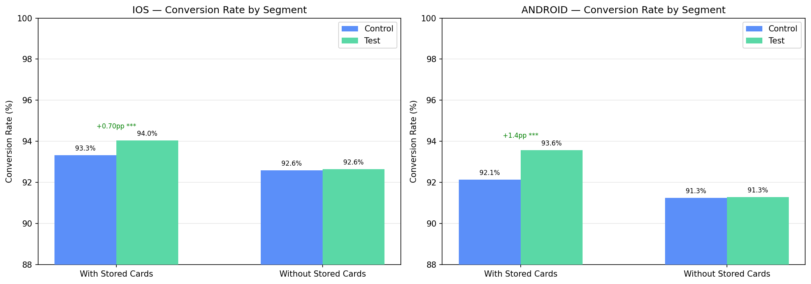
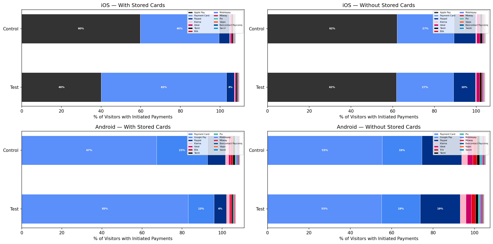
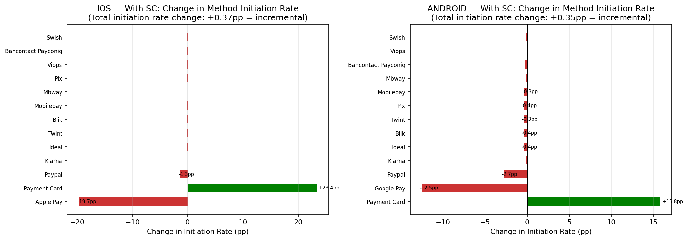
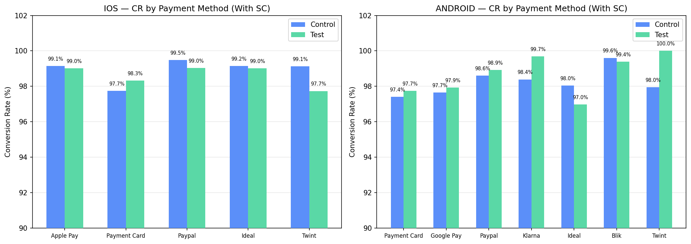
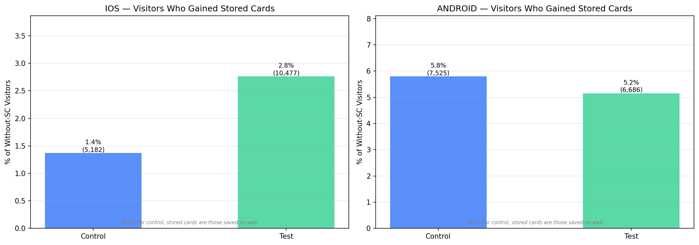
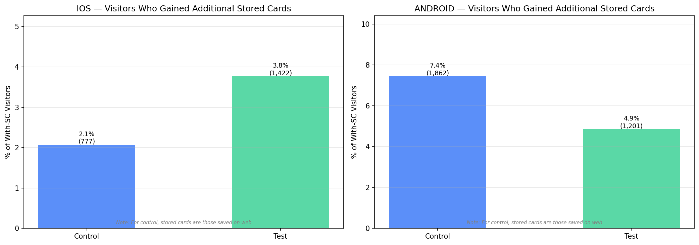
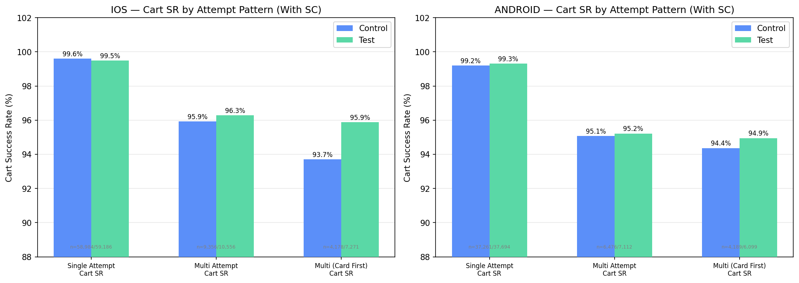
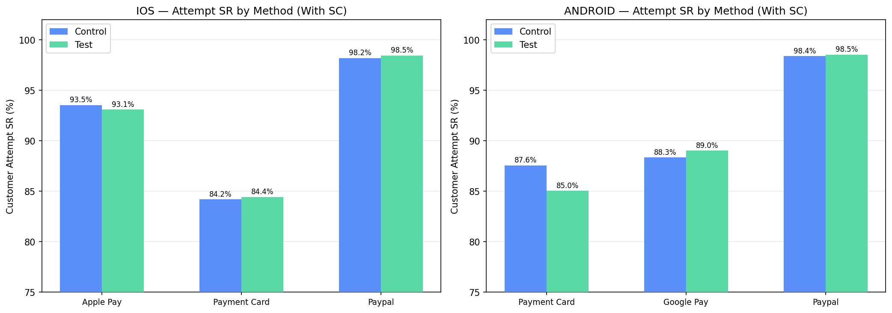

| | |
|---|---|
| **Experiment / reference** | iOS: `pay-payment-options-enable-stored-cards-ios::5` / Android: `pay-payment-options-enable-stored-cards-android::6` |
| **Hypothesis** | **FOR** mobile app customers who already have saved cards available at the payment step **IF** we surface stored cards directly in checkout and allow card saving for future use **THEN** more customers will initiate and complete payment with less friction, while customers without stored cards will not be harmed. |
| **Roll-out decision** | **Ship on iOS.** **Android directionally also looks positive, but fix instrumentation first.** The upside is concentrated in returning customers with stored cards; the no-stored-cards segment is flat. Android control contamination means the measured Android uplift is likely understated. |

# Summary

### Metrics outcome:

- **Experiment setup:** iOS and Android, 50/50 split. iOS window = 39 days (2026-03-13 to 2026-04-21), Android window = 33 days (2026-03-19 to 2026-04-21). Base = visitors reaching `MobileAppPaymentOptionsLoaded`.
- **Segment split:** only a minority of payment-page visitors were already eligible to benefit immediately from the feature: **9.0% on iOS** and **16.1% on Android** were in the **with stored cards** segment, meaning they had at least one card saved **before assignment** and could reuse it right away in app (in many cases because they had previously saved it on web, where this capability already existed). The remaining **91.0% on iOS** and **83.9% on Android** were in the **without stored cards** segment, meaning they had no saved card yet; for them, the business goal is mainly **no harm today** plus **creation of future stored-card inventory** rather than immediate conversion lift.
- **Primary business result, with stored cards:**
  - iOS: **+0.8% relative conversion uplift** (+0.70pp), **p=0.0001**
  - Android: **+1.6% relative conversion uplift** (+1.4pp), **p<0.001**
- **Guardrail result, without stored cards:** flat on both platforms across conversion, initiation, and payment success. No evidence of harm.
- **Payment initiation:** positive in the with-stored-cards segment on both platforms (+0.4% relative on iOS, +0.4% relative on Android), showing a small but real incrementality effect beyond pure cannibalization.
- **Stored card adoption:** among test users with stored cards and initiated payments, **57.8%** used a stored card on iOS and **76.7%** on Android.
- **Save-card opt-in among users who actually saw the checkbox:** **77.3% on iOS test** and **94.1% on Android test**. Android should be interpreted cautiously because of the instrumentation issue.
- **GCR impact:** small but positive: **+0.019% on iOS** and **+0.022% on Android**.
- **Attempt-level quality:** overall customer attempt SR looks weaker, but this is a mix-shift artifact. Visitor-level payment success improves and multi-attempt recovery is stable or better.
- **SRM / integrity:** split is balanced on both platforms. Main validity risk is not SRM, but the Android save-card instrumentation bug.

### Key learnings:

- **Stored cards work exactly where the product logic says they should:** the lift is concentrated in customers who already have stored cards and can immediately benefit from reduced payment friction.
- **The flat no-stored-cards segment is a success condition, not a disappointment:** this feature is not expected to create immediate lift for first-time card savers; the right question is whether it avoids harm while building future stored-card inventory. The data supports that.
- **Most of the payment-method shift is cannibalization, but not all of it:** customers do switch from Apple Pay / Google Pay / PayPal into stored-card-enabled card flows, yet total initiation still rises slightly, which means the feature is also unlocking some incremental payment starts.
- **Attempt-level SR alone would lead to the wrong business conclusion:** the apparent degradation comes from shifting volume toward card payments, not from a worse user experience. The actual user outcome that matters, payment success at visitor/cart level, improves or stays stable.
- **Android likely has more upside than the readout shows:** control users are being unintentionally allowed to save cards, which dilutes the control-vs-test difference and understates the real treatment effect.

### Product recommendation for future work:

- **Ship on iOS now** for returning customers with stored cards.
- **Fix Android instrumentation, then either re-measure or ship with careful monitoring.** Current Android direction is positive, but the experiment is contaminated.
- **Treat stored-card availability as a strategic CRM/payment asset:** this is not just a checkout UI change; it creates a reusable payment shortcut for returning customers.
- **For future experiments, split goals explicitly:** use immediate conversion impact for the with-stored-cards segment, and stored-card creation / future reuse for the without-stored-cards segment.

---

# Context

- The treatment shows stored cards directly on the mobile payment page for users who already have cards saved.
- It also allows eligible card payers in the test group to save a card for future reuse.
- In business terms, the experiment has **two very different customer jobs**:
  1. **With stored cards** = returning customers who already had a saved card before entering the experiment, often because they had stored it earlier on web. This is the monetization segment: they can immediately benefit from a lower-friction payment flow and are the group where we expect the clearest conversion upside.
  2. **Without stored cards** = customers who had no saved card before assignment. This is primarily a guardrail and growth segment: we do not expect large immediate conversion lift on the first visit, but we do want to avoid harming their experience and increase the share of users who save a card for future checkouts.
- The business question is not “does every user convert more,” but rather:
  1. does the feature unlock measurable value for returning users with saved cards,
  2. does it avoid harming users without saved cards,
  3. and does it build more future stored-card inventory?
- For control users, any “stored cards” observed come from cards previously saved on web.

---

## Deep Dive

### 1) Primary business outcomes: conversion and payment completion

**Base:** visitors who reached `MobileAppPaymentOptionsLoaded`.

The core business result is highly segmented:
- **With stored cards:** clear uplift on both platforms. These are the returning users who entered the payment page already having a saved card available, so they can use the feature immediately.
- **Without stored cards:** flat, which is expected. These users did not yet have a saved card at the moment of assignment, so the feature is mostly about preserving experience and creating future reuse potential rather than driving an immediate conversion jump.

#### With stored cards segment

| Platform | Metric | Relative Uplift | Delta (pp) | Control | Test | p-value | Significant |
|----------|--------|----------------|-----------|---------|------|---------|-------------|
| iOS | **Conversion Rate** | **+0.8%** | +0.70 | 93.3% | 94.0% | 0.0001 | Yes*** |
| iOS | Initiation Rate | +0.4% | +0.37 | 95.5% | 95.9% | 0.013 | Yes* |
| iOS | **Payment Success Rate** | **+0.4%** | +0.36 | 97.7% | 98.1% | 0.001 | Yes*** |
| Android | **Conversion Rate** | **+1.6%** | +1.4 | 92.1% | 93.6% | <0.001 | Yes*** |
| Android | Initiation Rate | +0.4% | +0.35 | 96.2% | 96.6% | 0.038 | Yes* |
| Android | **Payment Success Rate** | **+1.2%** | +1.1 | 95.8% | 96.9% | <0.001 | Yes*** |

**Interpretation:** this is the segment that matters commercially. Users who already have stored cards convert more because the product removes payment friction at the moment of intent. The effect is larger on Android, although Android should be treated as directionally conservative because of control contamination.

#### Without stored cards segment

| Platform | Metric | Relative Uplift | Delta (pp) | Control | Test | p-value | Significant |
|----------|--------|----------------|-----------|---------|------|---------|-------------|
| iOS | Conversion Rate | +0.06% | +0.06 | 92.6% | 92.6% | 0.348 | No |
| iOS | Initiation Rate | +0.01% | +0.01 | 94.97% | 94.98% | 0.891 | No |
| iOS | Payment Success Rate | +0.05% | +0.05 | 97.5% | 97.6% | 0.153 | No |
| Android | Conversion Rate | +0.03% | +0.03 | 91.3% | 91.3% | 0.780 | No |
| Android | Initiation Rate | -0.01% | -0.01 | 95.5% | 95.5% | 0.951 | No |
| Android | Payment Success Rate | +0.04% | +0.04 | 95.5% | 95.5% | 0.653 | No |

**Interpretation:** the lack of movement here is expected. Users without stored cards do not receive the immediate shortcut value on first exposure. The result still matters: there is **no measurable harm**.

#### Segment size and business relevance

| Platform | With Stored Cards | Without Stored Cards | % With Stored Cards |
|----------|------------------|----------------------|---------------------|
| iOS | ~37.7k | ~378.9k | **9.0%** |
| Android | ~24.9k | ~129.8k | **16.1%** |

The opportunity is concentrated in a relatively small but valuable segment. That is why total blended uplift would understate the product value.

Put differently: this is not a feature designed to change the behavior of every checkout visitor. It is designed to convert a relatively small group of high-intent returning customers more efficiently, while using the rest of the traffic to grow the future pool of saved-card users.

---

### 2) Mechanism metrics: how the feature creates value

This section answers whether the feature works in the way product expects: reuse of stored cards, shift in payment behavior, and growth of future stored-card inventory.

#### Stored card adoption in the with-stored-cards segment

| Platform | Test Initiated Visitors | Used Stored Card | Adoption Rate |
|----------|-------------------------|------------------|---------------|
| iOS | 36,197 | 20,923 | **57.8%** |
| Android | 23,890 | 18,328 | **76.7%** |

Once the feature is available, a large share of eligible users actually choose it. This is strong product-market fit for the payment shortcut itself.

#### Payment method mix shift

**Base:** visitors with initiated payments.

The mix shift confirms the mechanism:
- on iOS, volume moves from **Apple Pay** into **payment card / stored card**
- on Android, volume moves mainly from **Google Pay** and **PayPal** into **payment card / stored card**

| Platform | Biggest gain | Biggest losses |
|----------|--------------|----------------|
| iOS | Payment Card: **+23.4pp** | Apple Pay: -19.7pp, PayPal: -1.3pp |
| Android | Payment Card: **+15.8pp** | Google Pay: -12.5pp, PayPal: -2.7pp |

This is mostly channel substitution, but it is economically acceptable as long as overall conversion and payment success improve, which they do in the with-stored-cards segment.

#### Cannibalization vs incremental value

| Platform | Control Init Rate | Test Init Rate | Delta (pp) | Share of payment-card shift that is incremental |
|----------|------------------|---------------|------------|-----------------------------------------------|
| iOS | 95.49% | 95.86% | **+0.37pp** | **1.6%** |
| Android | 96.22% | 96.56% | **+0.35pp** | **2.2%** |

Interpretation:
- **Most of the mix shift is cannibalization**
- **A small but real part is incremental**
- that incremental piece is enough to matter because it compounds with higher visitor-level payment success

This is the right business framing: stored cards are not primarily creating new demand; they are converting existing demand more efficiently.

#### Conversion rate by payment method

Payment-card conversion improves in the test group on both platforms:
- iOS payment card: **97.7% -> 98.3%** (+0.59pp)
- Android payment card: **97.4% -> 97.7%** (+0.29pp)

That supports the thesis that the stored-card-enabled card flow is not just used more, but also performs at least as well or better at visitor level.

#### Save-card opt-in in the without-stored-cards segment

This is the forward-looking growth lever: users who do not yet have stored cards can build future stored-card inventory.

Base for the strict opt-in readout: visitors exposed to the save-card checkbox, meaning `save_card_consent` is explicitly `true` or `false` (not null).

| Platform | Variation | Saw Checkbox | Opted In | Opt-in Rate |
|----------|-----------|--------------|----------|-------------|
| iOS | **Test** | 23,334 | 18,045 | **77.3%** |
| Android | **Test** | 58,399 | 54,953 | **94.1%** |

Among all card payers, the broader rate is:

| Platform | Variation | Visitors with Card Payment | Opted to Save Card | Opt-in Rate |
|----------|-----------|---------------------------|-------------------|-------------|
| iOS | **Test** | 99,830 | 18,045 | **18.1%** |
| Android | **Test** | 74,813 | 54,953 | **73.4%** |

The strict exposed-only readout is the better behavioral measure. Android test should still be interpreted carefully because the platform bug may influence defaults.

#### Future stored-card inventory

Among users who started without stored cards:

| Platform | Variation | Started Without SC | Gained Stored Cards | Rate |
|----------|-----------|--------------------|---------------------|------|
| iOS | Control | 378,418 | 5,182 | 1.4% |
| iOS | **Test** | 379,294 | **10,477** | **2.8%** |
| Android | Control | 129,773 | 7,525 | 5.8% |
| Android | **Test** | 129,740 | **6,686** | **5.2%** |

On iOS, the test almost doubles stored-card creation for previously uncovered users. This is strategically important because it grows the future pool of high-converting returning customers.

Among users who already had stored cards:

| Platform | Variation | With SC Visitors | Gained More Cards | Rate |
|----------|-----------|------------------|-------------------|------|
| iOS | Control | 37,575 | 777 | 2.1% |
| iOS | **Test** | 37,760 | **1,422** | **3.8%** |
| Android | Control | 25,006 | 1,862 | 7.4% |
| Android | **Test** | 24,740 | **1,201** | **4.9%** |

Again, iOS shows the intended effect. Android is distorted by the control bug.

---

### 3) Quality guardrails: why the negative attempt-level signal is not a blocker

At first glance, the attempt-level view looks worse because more traffic moves into card flows, which structurally have lower per-attempt SR than Apple Pay / Google Pay / PayPal.

That is **not** the right business conclusion.

#### The apparent paradox

- Customer Attempt SR looks weaker in the test
- Yet visitor-level payment success improves
- The reason is mix shift, not quality degradation

#### Cart / retry behavior

| Platform | Metric | Control | Test | Delta |
|----------|--------|---------|------|-------|
| iOS | Single-attempt carts | 58,984 (86.3%) | 59,186 (84.9%) | -1.4pp share |
| iOS | Multi-attempt carts | 9,356 (13.7%) | 10,556 (15.1%) | +1.4pp share |
| iOS | Single-attempt eventual success | 99.6% | 99.5% | -0.12pp |
| iOS | Multi-attempt eventual success | 95.9% | 96.3% | +0.34pp |
| Android | Single-attempt carts | 37,261 (85.2%) | 37,694 (84.1%) | -1.1pp share |
| Android | Multi-attempt carts | 6,476 (14.8%) | 7,112 (15.9%) | +1.1pp share |
| Android | Single-attempt eventual success | 99.2% | 99.3% | +0.10pp |
| Android | Multi-attempt eventual success | 95.1% | 95.2% | +0.15pp |

#### Multi-attempt carts starting with card

| Platform | Card-first multi-attempt carts | Control | Test | Eventual success |
|----------|-------------------------------|---------|------|------------------|
| iOS | Count | 4,178 | 7,271 | 93.7% -> **95.9%** |
| Android | Count | 4,189 | 6,099 | 94.4% -> **94.9%** |

**Interpretation:** stored cards push more users into card-first behavior, so retries become slightly more common. But once those retries happen, recovery is stable or better. This is why the business outcome improves despite lower-looking attempt SR.

#### Attempt SR by method

| Platform | Method | Control SR | Test SR | Delta |
|----------|--------|-----------|---------|-------|
| iOS | Apple Pay | 93.5% | 93.1% | -0.45pp |
| iOS | Payment Card | 84.2% | 84.4% | +0.25pp |
| iOS | PayPal | 98.2% | 98.5% | +0.26pp |
| Android | Payment Card | 87.6% | 85.0% | -2.5pp |
| Android | Google Pay | 88.4% | 89.0% | +0.68pp |
| Android | PayPal | 98.4% | 98.5% | +0.14pp |

The aggregate attempt signal is dominated by **which method users choose more often**, not by a consistent within-method degradation.

**Business conclusion:** do not use overall customer attempt SR as the go/no-go metric for this feature. Visitor-level success and segment conversion are the right decision metrics.

---

### 4) Experiment integrity and rollout confidence

#### Assignment funnel and segment composition

| Platform | Variation | Assigned | Payment Page | % Reached PP | With SC | Without SC |
|----------|-----------|----------|--------------|--------------|---------|------------|
| iOS | Control | 1,380,765 | 415,993 | 30.1% | 37,575 (9.0%) | 378,418 (91.0%) |
| iOS | Test | 1,383,521 | 417,054 | 30.1% | 37,760 (9.1%) | 379,294 (90.9%) |
| Android | Control | 331,721 | 154,779 | 46.7% | 25,006 (16.2%) | 129,773 (83.8%) |
| Android | Test | 331,777 | 154,480 | 46.6% | 24,740 (16.0%) | 129,740 (84.0%) |

**SRM passed:** splits are balanced on both platforms. The experiment integrity issue is not traffic allocation; it is Android measurement contamination.

#### GCR uplift

At total-company level, the uplift is small but positive:

| Platform | GCR uplift |
|----------|------------|
| iOS | **+0.019%** |
| Android | **+0.022%** |

This is expected because only a minority of payment-page visitors are in the immediately eligible stored-card segment.

#### Android instrumentation bug

The Android app hardcodes `save_card_consent = true` for control users in credit-card flows. That means:
- control users can silently save cards
- returning control users may later behave like treated users
- measured Android uplift is diluted

Evidence:
- Android control: **13,035 / 13,035 exposed users appear opted in**
- Android control has **no meaningful false values**
- Android control gains stored cards at **5.8%**, above Android test at **5.2%**

**Interpretation:** Android is directionally positive, but not cleanly measurable in its current form.

---

## Follow-up questions

- What is the **repeat-booking revenue value** of expanding the stored-card pool created by iOS test users?
- Are there subsegments where the with-stored-cards lift is even larger, such as high-frequency bookers, logged-in users, or users with prior card success?
- After fixing Android instrumentation, does Android retain the higher adoption / opt-in pattern seen here, or is part of it a default-state artifact?

## Limitations

- **Android contamination:** the Android experiment is not clean because control users can silently save cards.
- **Blended readout would be misleading:** most users are in the without-stored-cards segment, so overall totals understate the business value of the feature.
- **Opt-in on Android test should be interpreted cautiously:** even though control is excluded from the opt-in readout, the same instrumentation family may still influence test defaults.
